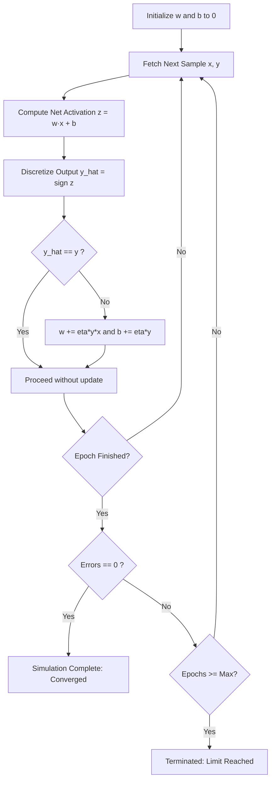

# Training Process

Training proceeds across discrete epochs. In each epoch, the model cycles deterministically through all samples in the training set.

## Execution Flowchart

## Convergence Telemetry

During execution in the REC Labs runtime, the system monitors:

- **Current Epoch**: The pass number through the entire dataset.
- **Active Sample**: The coordinates currently evaluated on the canvas.
- **Epoch Error Count**: The total classification discrepancies observed during the current sweep.
- **Hyperplane State**: The current coefficients $[w_1, w_2, b]$ defining the boundary.
